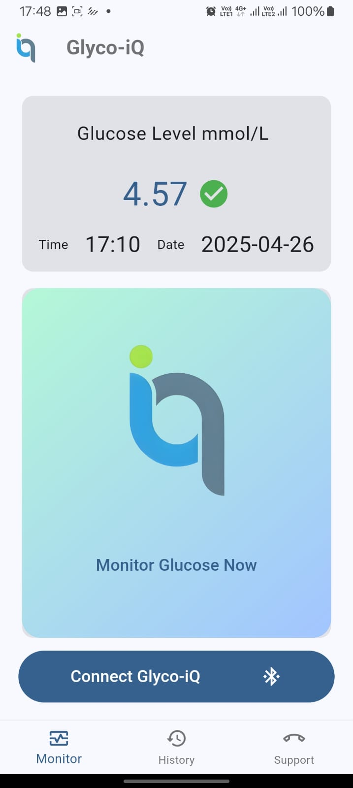
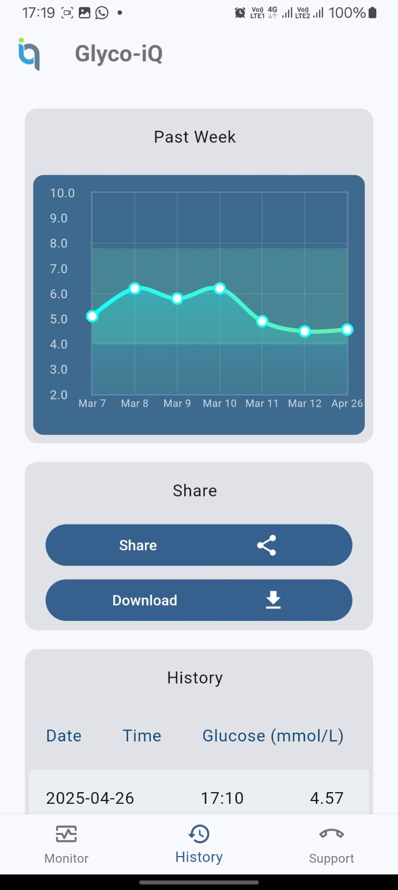
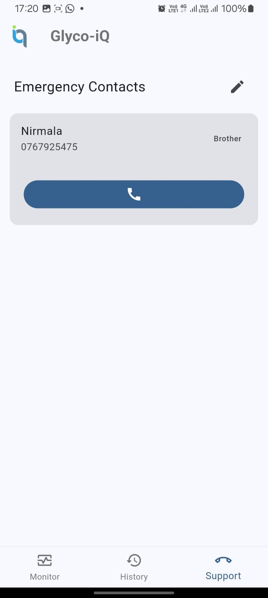

# Glyco iQ

Glyco iQ is a non-invasive glucose measuring device developed by a group of undergraduates from the University of Moratuwa. The product features a novel approach to traditional glucose measuring which is done by the finger pricking method. GlycoiQ introduces an innovative approach with the use of laser technology, machine learning, and IoT (Internet of Things).

This repository houses the companion mobile application where the user views glucose results. The app features:

- Bluetooth connectivity to GLycoiQ device.
- Measuring glucose and viewing results.
- Classification of glucose level according to  [WHO](https://www.who.int/data/gho/indicator-metadata-registry/imr-details/2380).
- Visualizing and viewing glucose history.
- Options to share or download history as pdf.
- Emergency contacts and direct calling facility.

Home | History | Emergency
---|---|---
||

Technology Stack
- Flutter (Dart)

I worked on developing the Mobile application for the main project GlycoiQ by **Team Synop**.
Team Members of the main project: 
- [Yehen Asuramuni](https://github.com/yhnx)
- [Oshadha Nimantha](https://github.com/Oshadha-Nimantha)
- [Sineth Jayawardana](https://github.com/SinethS)
- [Agrajith Weragoda]()

